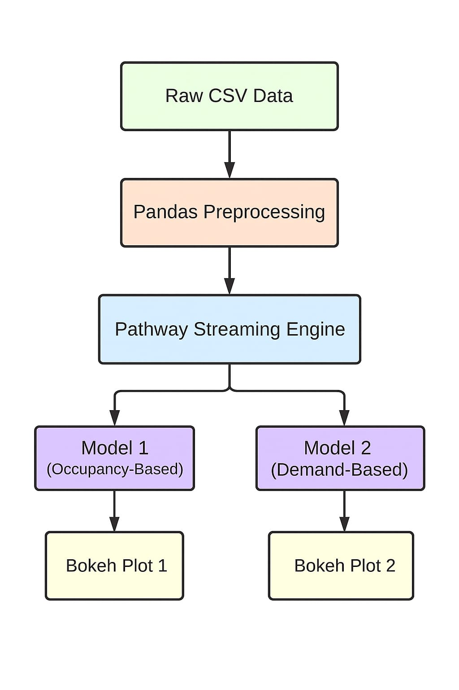

# IIT G-Summer Analytics-2025-Capstone-Project

# 🚗 Dynamic Pricing for Urban Parking Lots

This capstone project implements **dynamic pricing** models using real-time streaming data for urban parking lots.
The goal is to optimize pricing based on demand indicators like occupancy, traffic, queue length, and special days.

## 📌 Models Implemented

### 📘 Model 1: Occupancy-Based Pricing

A simple rule-based model that adjusts price linearly with occupancy percentage.

### 📗 Model 2: Demand-Based Pricing

A more advanced model using multiple demand factors:

- Queue Length (normalized)
- Traffic Condition (scored)
- IsSpecialDay (binary)
- VehicleWeight (mapped from vehicle type)
- Occupancy / Capacity

### 💡 Demand Function

```
demand = 2 * (occupancy / capacity) + queue_norm + traffic_norm + is_special_day + vehicle_weight
price = 10 + 5 * norm_demand
```

---

## ⚙️ Tech Stack

| Component        | Technology                                                |
| ---------------- | --------------------------------------------------------- |
| Notebook         | Google Colab                                              |
| Streaming Engine | [Pathway](https://github.com/pathwaycom/pathway) (Python) |
| Data Handling    | `pandas`, `csv`                                           |
| Visualization    | `bokeh`, `panel`                                          |
| Document Report  | `python-docx`                                             |
| Plot Capture     | Bokeh HTML Viewer                                         |

---

## 📊 Architecture Flow

```
    Raw CSV Dataset
          │
          ▼
  ┌───────────────────┐
  │ Preprocessing     │ ←─ Cleaning, feature engineering using pandas
  └───────────────────┘
          │
          ▼
  ┌───────────────────┐
  │ Pathway Streaming │ ←─ .replay_csv + schema + time window
  └───────────────────┘
          │
          ▼
  ┌───────────────────┐
  │ Model 1 / Model 2 │ ←─ Reduce & with_columns for price logic
  └───────────────────┘
          │
          ▼
  ┌───────────────────┐
  │ Visualization     │ ←─ Bokeh + Panel live plot
  └───────────────────┘
```

---

## 📷 Architecture Diagram




---

## 📁 Project Files

- `Capstone_Pricing_Model_1,2.ipynb` – Main notebook
- `parking_stream_full.csv` – Cleaned input data
- `Modified-modified.csv`
- `dataset.csv` - Raw Dataset
- `Parking_Pricing_Project_Report.docx` – Final submission report
- `README.md` – This file

---

## 📝 Submission Guidelines Followed

✅ Well-commented Colab notebook  
✅ Report explaining steps, demand function, and assumptions  
✅ Bokeh visualizations for both models  
✅ Architecture diagram and tech stack explained in README

---

## 📬 Contact

Project by: Debojyoti Sinha Thakur
Capstone Project for IIT G Summer Analytics 2025
